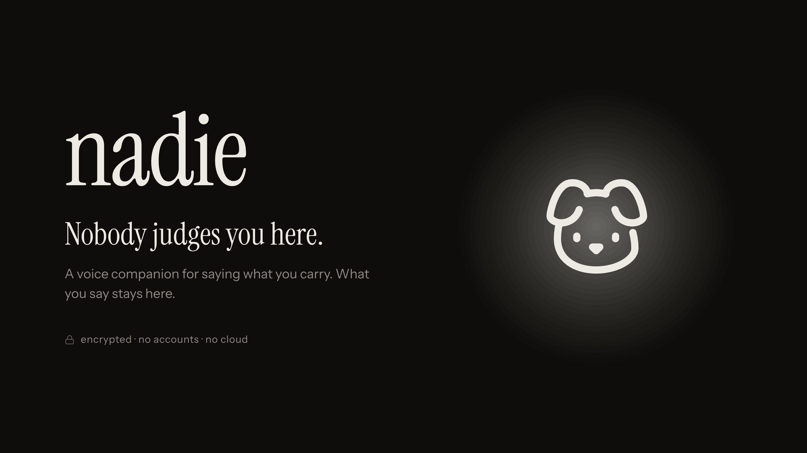

# Nadie

**Private AI for the things you can't say out loud yet.**

*Nadie* is Spanish for *nobody*. Who reads what you tell your AI? Nobody.

An emotional companion that runs a language model inside your browser, keeps your mood history on your device, and shares with a verified psychologist only the text you read and sign. Built at the EAG Global Buildathon, Cochabamba, Bolivia, September 11–13, 2026. **Track 02: Local AI, Private AI & User-Owned Data**, with consent and professional credentials deployed on **HashKey Chain Testnet**.

| | |
|---|---|
| Demo video | `TODO_SUNDAY_VIDEO_URL` |
| Live app | `TODO_SUNDAY_APP_URL` |
| Technical documentation | [docs/TECHNICAL.md](docs/TECHNICAL.md) — track, architecture, features, roadmap |
| Original design document (Spanish) | [docs/ARQUITECTURA.MD](docs/ARQUITECTURA.MD) — the pre-event design; broader than what was built |
| Development rules (Spanish) | [docs/REGLAS.md](docs/REGLAS.md) |

---

## The problem

Millions of people now tell an AI things they have never told a human. Every one of those messages sits on someone else's server, readable by the company that runs it.

The people who most need to be heard are the ones who can least afford to be identified: teenagers, people in small towns where the therapist knows your family, anyone afraid of what happens when a secret leaves their hands.

Existing mental health apps ask for your email, your phone number, and your trust. Nadie asks for none of the three.

## Features

What works today, end to end, on HashKey Chain Testnet:

- **Private conversation with a local model.** Qwen2.5-1.5B runs in the browser through WebLLM and WebGPU (Llama-3.2-1B as a lighter fallback). The conversation is text, lives only in memory for the session, and is never sent anywhere. If the device cannot run the model, the app says so instead of faking a reply.
- **Daily mood check-in.** After talking, the person rates the day from 1 to 10 and can add a note. The local model may highlight a suggested value; only the person's tap writes the score.
- **"Tu camino".** A 28-day mood curve and a week strip, drawn from the log stored on the device.
- **Share with a verified psychologist, only with consent.**
  1. The local model drafts a short third-person summary; the last 28 days of mood are appended.
  2. The person reads the exact text that will leave the device.
  3. The text is encrypted on the device to the psychologist's registered public key (HPKE X25519 + AES-256-GCM).
  4. The person's device signs an EIP-712 consent; a relayer pays the gas and posts it to `ConsentRegistry`.
  5. The consent expires after 7 days. The app links to the transaction in the HashKey explorer.
- **Psychologist portal.** A separate app, in Spanish, where a psychologist:
  - registers a reading key on-chain;
  - sees incoming shares;
  - records the first opening on-chain;
  - proves wallet ownership to the gateway;
  - decrypts locally and reads the summary, the mood curve and the daily journal.
- **Privacy claims backed by tests.** A static test fails the build if the app references any undeclared third-party origin, and a browser test drives a full private session asserting that every request stays local (details in [Tests](#tests)).

Not built yet, and listed honestly in the [roadmap](docs/TECHNICAL.md#6-roadmap):
- voice;
- editable long-term memory;
- revoking from the app (the contract and relayer already support it);
- an automatic crisis detector (today there is a fixed helpline in Settings);
- encrypted local storage (the vault module exists but is not wired in; the mood log is in `localStorage`);
- TEE fallback inference and ZK vouchers.

Nadie does not diagnose, does not treat, and does not replace professional care.

## Why Ethereum

Consent is the whole product, so consent cannot be a row in our database.

- **The grant is a signature the user made.** Not a record we wrote about them. We cannot forge it.
- **The first opening is a public, append-only event.** `open()` records the first time the psychologist opened the package; nobody, including us, can quietly erase it.
- **The gateway does not decide.** Before releasing a package it reads `ConsentRegistry` at a specific block: consent valid, not expired, not revoked, professional still verified, first opening recorded. Compromise our server and the attacker still cannot mint a valid consent.

We call this the **2-of-2**: the AI prepares, the human signs, and nothing leaves without both.

## What is on-chain, and what never is

| Data | Where it lives |
|---|---|
| Conversation | Browser memory, for the session only. Never on-chain, never on a server |
| Mood log and notes | The person's device. Never on-chain |
| Shared summary + mood journal | Gateway, as an encrypted package only the psychologist can open. On-chain: its Keccak-256 hash |
| Consent | On-chain: user address, professional address, package hash, scope hash, expiry, first opening, revocation |
| Professional credential | On-chain: address, display name, X25519 public key, validity |

The chain is the notary. It is not the vault.

## Repo map

```
packages/
  frontend/    The person's app. React + Vite, WebLLM adapter, sharing flow
  clinician/   The psychologist's portal. React + Vite, viem, local decryption
  core/        Encrypted package format (HPKE + AES-GCM), shared schemas and ports
  contracts/   ProfessionalRegistry and ConsentRegistry. Solidity + Foundry
  gateway/     Stores encrypted packages; releases them only on a valid on-chain consent
  relayer/     Submits the user's signed EIP-712 consents and pays the gas
  e2e/         Full backend test on Anvil, and a read-only smoke test on HashKey
docs/
  TECHNICAL.md      Technical documentation
  ARQUITECTURA.MD   Original design document (Spanish)
  REGLAS.md         Development rules and invariants (Spanish)
  PLAN_BACKEND.md   Backend work units and acceptance criteria (Spanish)
```

## Technical integration approach

```
 Person's browser                     Off-chain services              HashKey Chain Testnet (133)
 ─────────────────                    ──────────────────              ───────────────────────────
 WebLLM drafts summary
 person reads and approves
 encrypt to psychologist key ──PUT──▶ gateway stores ciphertext
 sign EIP-712 Grant ─────────POST───▶ relayer ─── grantWithSig ─────▶ ConsentRegistry
                                                                        │ checks ProfessionalRegistry
 Psychologist portal                                                    │
 open(consentId) ──────────────────────────────────────────────────────▶ Opened event (first time)
 request challenge ─────────────────▶ gateway
 sign challenge (EIP-191) ──────────▶ gateway reads consent at block N
                                     ◀─ encrypted package if valid
 decrypt locally with reading key
```

- **Encryption** (`@nadie/core`): one fresh AES-256-GCM key per package, wrapped with HPKE (RFC 9180, X25519). The hash on-chain is of the ciphertext, never the plaintext.
- **Consent** (`ConsentRegistry`): EIP-712 domain `NadieConsentRegistry` v1, chain 133. `Grant(consentId, user, professional, packageHash, scope, expiresAt, nonce, deadline)`. Any relayer can submit a valid signature; the contract checks the signer.
- **Credentials** (`ProfessionalRegistry`): the psychologist registers an X25519 public key with `registerKey`; an authorized verifier then calls `issue`. An optional HashKey KYC adapter hook exists and is disabled in the testnet deployment.
- **Gasless for the person**: the app creates a local signing account; the relayer pays gas, with rate limits, idempotency keys and a gas cap.
- **Release**: the gateway verifies a one-time challenge signature, then reads the consent at a fixed block and re-hashes the stored package before returning it.

Full detail: [docs/TECHNICAL.md](docs/TECHNICAL.md).

## Installation

Requirements:

- Node.js 20+ and pnpm 10.
- A Chromium-based browser with WebGPU. A desktop or laptop is recommended: most phones today cannot fit the 1.5B model.
- [Foundry](https://book.getfoundry.sh/) (`forge`, `cast`) for contracts and for verifying a psychologist.
- For the portal: a browser wallet (for example MetaMask) on HashKey Chain Testnet with some testnet HSK.

```bash
git clone --recurse-submodules https://github.com/Firrton/nadie.git
cd nadie
pnpm install
```

## Running the project

### Option A — the app only (no sharing)

```bash
pnpm --filter @nadie/frontend dev   # http://localhost:5173
```

Conversation, check-in and "Tu camino" work. The first run downloads about 900 MB of model weights into the browser cache; after that it works offline. Without the sharing variables the share button is simply not shown.

### Option B — the full flow on HashKey Chain Testnet

**1. Configure.** Copy the example files and fill in your values. Never commit the copies.

```bash
cp .env.example .env                                            # gateway + relayer
cp packages/frontend/.env.example packages/frontend/.env.local  # person's app
cp packages/clinician/.env.example packages/clinician/.env.local  # portal
```

- **In `.env`:** set `RELAYER_PRIVATE_KEY` to a testnet-only wallet funded with HSK. The contract addresses are already filled in.
- **In `packages/clinician/.env.local`:** set the HashKey RPC, the two contract addresses and `VITE_GRANTED_FROM_BLOCK=33013114`.
- **In `packages/frontend/.env.local`:** set `VITE_PSICOLOGA_ADDRESS` to the psychologist's wallet address.

**2. Start the services.** Each one in its own terminal:

```bash
pnpm --filter @nadie/gateway exec tsx --env-file=../../.env src/server.ts   # :8787
pnpm --filter @nadie/relayer dev                                             # :8788
pnpm --filter @nadie/frontend dev                                            # :5173
pnpm --filter @nadie/clinician dev                                           # :5174
```

The gateway and relayer accept a single browser origin (`GATEWAY_ALLOWED_ORIGIN`, `RELAYER_ALLOWED_ORIGIN`), `http://localhost:5173` by default. The portal reaches the gateway through its own Vite proxy.

**3. Onboard a psychologist.**

1. The psychologist opens the portal, connects their wallet, creates a reading key, saves it, and registers it on-chain.
2. A verifier authorized in `ProfessionalRegistry` issues the credential. `expiresAt` is a Unix timestamp in the future.

   ```bash
   cast send 0xD615074c2603336fa0Da8AF44B5CCB9D9C0B2F9c \
     "issue(address,string,uint40)" <PSYCHOLOGIST_ADDRESS> "Display name" <EXPIRES_AT> \
     --rpc-url https://testnet.hsk.xyz --account <VERIFIER_KEYSTORE>
   ```

**4. Use it.** In the app: talk, rate the day, tap "Compartir con tu psicóloga", read the text, send. In the portal: the share appears as new; "Leer" asks the wallet to confirm the opening and sign the challenge, then shows the summary, the curve and the journal.

### Optional — serve the model weights yourself

Downloads through the browser cannot resume. To download once to disk and serve locally instead of from Hugging Face:

```bash
packages/frontend/banco/bajar-modelo.sh Qwen2.5-1.5B-Instruct-q4f16_1-MLC   # into ~/.cache/nadie-modelos
pnpm --filter @nadie/frontend banco:modelos                                 # http://127.0.0.1:8899
```

Then set `VITE_MODELOS_BASE=http://127.0.0.1:8899` in `packages/frontend/.env.local`. A public deployment must point this at an HTTPS host it controls.

## Tests

| Command | What it proves |
|---|---|
| `pnpm test` | Unit tests of every package (Vitest; Foundry for contracts) |
| `pnpm --filter @nadie/frontend test` | Includes [`no-external-requests.test.js`](packages/frontend/test/no-external-requests.test.js): fails if the app or its bundle points at an undeclared origin |
| `pnpm --filter @nadie/frontend test:e2e` | [`private-session.e2e.test.js`](packages/frontend/test/e2e/private-session.e2e.test.js): a real browser runs a full session on the production build; every request must stay local. Needs Chromium for Playwright |
| `pnpm --filter @nadie/contracts test` | Registry and consent rules, EIP-712 signatures, deploy script |
| `pnpm test:backend-e2e` | Contracts, relayer, gateway and decryption end to end on a local Anvil chain |
| `pnpm smoke:backend:hashkey` | Read-only check that the deployed contracts on HashKey Testnet are wired as documented |

## Deployed contracts

| Contract | Network | Address |
|---|---|---|
| ProfessionalRegistry | HashKey Chain Testnet (133) | [`0xD615074c2603336fa0Da8AF44B5CCB9D9C0B2F9c`](https://testnet-explorer.hsk.xyz/address/0xD615074c2603336fa0Da8AF44B5CCB9D9C0B2F9c) |
| ConsentRegistry | HashKey Chain Testnet (133) | [`0xdc3c4c07e4675cf1BBDEa627026e92170f9F5AE1`](https://testnet-explorer.hsk.xyz/address/0xdc3c4c07e4675cf1BBDEa627026e92170f9F5AE1) |

## Safety

Nadie is a companion, not a clinician.
- **It does not diagnose or share anything automatically.** It also does not tell the person what they feel: the model is instructed to listen, reflect and ask, with no clinical language.
- **Crisis support today:** a fixed helpline in Settings. An automatic crisis detector is roadmap work.
- **Audience and data:** the MVP is for adults only, and all demo data is synthetic.

## Original work

No code, components, design tokens, or application assets are inherited from another repository. The Nadie implementation is built from scratch in this repository during the buildathon.


## License

MIT. See [LICENSE](LICENSE).
